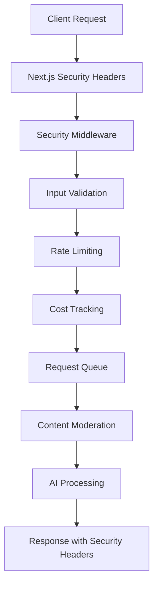

# 🔒 Security Setup Documentation

## Overview

This document describes the comprehensive security hardening implemented for the Moral Compass AI application. The security system provides multi-layered protection against common attack vectors including DoS attacks, cost bombing, prompt injection, and automated abuse.

## Table of Contents

- [Security Architecture](#security-architecture)
- [Security Layers](#security-layers)
- [Attack Protection](#attack-protection)
- [Configuration](#configuration)
- [Monitoring & Logging](#monitoring--logging)
- [Development vs Production](#development-vs-production)
- [Troubleshooting](#troubleshooting)

## Security Architecture

The security system implements a **defense-in-depth** strategy with multiple layers:



## Security Layers

### 1. Next.js Security Headers (`next.config.ts`)

**Purpose**: First line of defense at the framework level

**Headers Applied**:
- `X-Content-Type-Options: nosniff` - Prevents MIME type sniffing
- `X-Frame-Options: DENY` - Prevents clickjacking attacks
- `X-XSS-Protection: 1; mode=block` - Enables browser XSS protection
- `Referrer-Policy: no-referrer` - Prevents referrer leakage
- `Permissions-Policy` - Restricts camera, microphone, geolocation
- `Strict-Transport-Security` (Production) - Enforces HTTPS
- `Content-Security-Policy` (API routes) - Restricts content sources

### 2. Input Validation (`src/lib/validation.ts`)

**Purpose**: Validates and sanitizes all incoming requests

**Validations**:
- **Request Size**: Maximum 100KB payload size
- **Message Count**: Maximum 10 messages per request
- **Text Length**: Maximum 10,000 characters total
- **Schema Validation**: Validates request structure using Zod
- **Prompt Injection Detection**: 13 patterns to detect manipulation attempts

**Prompt Injection Patterns**:
```typescript
/ignore\s+previous\s+instructions/i
/act\s+as\s+a\s+different\s+(character|person|ai)/i
/system\s*:\s*/i
/\[INST\]|\[\/INST\]/i
// ... and 9 more patterns
```

**PII Redaction**:
- Email addresses → `[redacted-email]`
- Phone numbers → `[redacted-phone]`
- Credit card numbers → `[redacted-card]`

### 3. Enhanced Rate Limiting (`src/lib/rateLimit.ts`)

**Purpose**: Prevents DoS attacks and abuse through request throttling

**Multi-Tier Limits**:
- **Basic**: 5 requests per minute
- **Burst**: 20 requests per hour
- **Daily**: 100 requests per day

**Specialized Limits**:
- **PDF Generation**: 3 per minute
- **Vector Searches**: 10 per minute
- **Expensive Operations**: 2 per minute

**Client Identification**:
```typescript
// Enhanced fingerprinting beyond IP
function generateFingerprint(req) {
  const fingerprintData = `${userAgent}:${acceptLang}:${acceptEnc}`;
  return sha256(fingerprintData).slice(0, 16);
}
```

### 4. Cost Tracking (`src/lib/costTracking.ts`)

**Purpose**: Prevents cost bombing attacks by monitoring API usage costs

**Cost Estimation**:
- **GPT-4.1-nano**: ~$0.0003 per request
- **Embeddings**: ~$0.00002 per request
- **Moderation**: ~$0.00002 per request
- **Pinecone**: ~$0.0001 per query

**Cost Limits**:
- **Hourly**: $1.00 (default) / $0.10 (testing)
- **Daily**: $5.00 (default) / $0.50 (testing)
- **Monthly**: $50.00 (default) / $2.00 (testing)

**Cost Tracking Storage**:
```typescript
// Redis-based cost accumulation
{
  daily: 0.15,      // $0.15 spent today
  hourly: 0.05,     // $0.05 spent this hour
  monthly: 0.85,    // $0.85 spent this month
  lastReset: {
    daily: "2024-01-15",
    hourly: "2024-01-15T14:00:00.000Z",
    monthly: "2024-01"
  }
}
```

### 5. Request Queue Management (`src/lib/requestQueue.ts`)

**Purpose**: Prevents resource exhaustion through concurrent request management

**Queue Configuration**:
- **Decision Queue**: 2-3 concurrent requests, 30-45s timeout
- **PDF Queue**: 1 concurrent request, 20-30s timeout
- **Vector Queue**: 3-5 concurrent requests, 8-10s timeout

**Using fastq for Lightweight Queuing**:
```typescript
const decisionQueue = fastq.promise(
  (task) => createWorker(task, timeout),
  concurrency
);
```

**Queue Monitoring**:
- Real-time queue length and running task counts
- Overload detection (80% of interval capacity)
- Graceful degradation when overloaded

### 6. Security Middleware (`src/lib/security.ts`)

**Purpose**: Orchestrates all security checks in a single middleware

**Security Checks (in order)**:
1. **Origin Validation** - CORS protection
2. **User Agent Validation** - Bot detection
3. **Queue Overload Check** - System capacity
4. **Input Validation** - Content validation
5. **Rate Limiting** - Request throttling
6. **Cost Limits** - Spending protection

**Security Response**:
```typescript
interface SecurityCheckResult {
  allowed: boolean;
  reason?: string;
  clientId: string;
  validationResult: ValidationResult;
  rateLimitResult: MultiTierLimitResult;
  costLimitResult: CostLimitResult;
  headers: Headers;
}
```

## Attack Protection

### DoS (Denial of Service) Protection

**Queue-Based Protection**:
- Limits concurrent processing to prevent resource exhaustion
- Queues excess requests instead of rejecting them
- Timeout protection prevents hanging requests

**Rate Limiting**:
- Multi-tier limits catch different attack patterns
- IP + fingerprint based identification
- Exponential backoff through retry headers

### Cost Bombing Protection

**Real-Time Cost Tracking**:
- Estimates cost before processing
- Tracks actual costs after processing
- Automatic period resets (hourly/daily/monthly)

**Cost Limits Enforcement**:
- Rejects requests that would exceed limits
- Detailed cost breakdown in responses
- Redis-based persistence across server restarts

### Prompt Injection Protection

**Detection Patterns**:
- System instruction manipulation
- Role confusion attempts
- Framework-specific injection patterns
- Context breaking attempts

**Sanitization**:
- Replaces detected patterns with `[REDACTED]`
- Logs suspicious activity for monitoring
- Risk level assessment (low/medium/high)

### Automated Traffic Protection

**User Agent Filtering**:
- Blocks obvious bot patterns
- Allowlist for legitimate crawlers
- Fingerprinting beyond user agent

**Origin Validation**:
- CORS enforcement in production
- Domain allowlisting
- Development bypass for localhost

## Configuration

### Environment Variables

**Required for Production**:
```bash
OPENAI_API_KEY=sk-...
PINECONE_API_KEY=...
KV_REST_API_URL=https://...
KV_REST_API_TOKEN=...
ALLOWED_ORIGINS=https://yourdomain.com
```

**Security Tuning**:
```bash
# Cost Limits (USD)
DAILY_COST_LIMIT=5.00
HOURLY_COST_LIMIT=1.00
MONTHLY_COST_LIMIT=50.00

# Queue Configuration
DECISION_QUEUE_CONCURRENCY=3
DECISION_QUEUE_TIMEOUT=45000
PDF_QUEUE_CONCURRENCY=1
VECTOR_QUEUE_CONCURRENCY=5

# Security
ALLOWED_ORIGINS=https://domain1.com,https://domain2.com
ALLOWED_BOTS=GoogleBot,BingBot
```

### Current Testing Configuration

**Restrictive Settings** (configured in `.env.local`):
- **Cost Limits**: $0.10/hour, $0.50/day, $2.00/month
- **Queue Concurrency**: Reduced by 25-50%
- **Timeouts**: Reduced by 20-33%
- **Origins**: Localhost only

## Monitoring & Logging

### Security Event Logging

**Event Types**:
- `prompt_injection` - Suspicious input patterns detected
- `rate_limit` - Rate limit violations
- `cost_limit` - Cost limit violations
- `validation_error` - Input validation failures

**Log Format**:
```typescript
{
  timestamp: "2024-01-15T14:30:00.000Z",
  type: "prompt_injection",
  clientId: "192.168.1.1:abc123",
  details: {
    patterns: ["ignore\\s+previous\\s+instructions"],
    textLength: 150,
    riskLevel: "high"
  }
}
```

### Queue Monitoring

**Metrics Tracked**:
- Queue length and running tasks
- Average wait times
- Timeout occurrences
- Overload events

**Queue Stats API**:
```typescript
{
  decision: {
    length: 2,      // Queued requests
    running: 1,     // Currently processing
    idle: false,    // Queue status
    concurrency: 2  // Max concurrent
  }
}
```

### Cost Monitoring

**Usage Tracking**:
- Real-time cost accumulation
- Per-user spending patterns
- Cost breakdown by operation type
- Period-over-period analysis

## Development vs Production

### Development Mode
- **Origin Validation**: Disabled (allows localhost)
- **Rate Limiting**: In-memory fallback if Redis unavailable
- **Security Headers**: Basic set without HSTS
- **Logging**: Console output only

### Production Mode
- **Origin Validation**: Enforced with domain allowlist
- **Rate Limiting**: Redis-based with persistence
- **Security Headers**: Full set including HSTS
- **Logging**: Structured logging with monitoring integration

### Testing Configuration
- **Ultra-low cost limits**: $0.10/hour prevents abuse
- **Reduced concurrency**: 2 instead of 3 concurrent requests
- **Faster timeouts**: Earlier failure detection
- **Localhost only**: Restricted access

## Troubleshooting

### Common Issues

**"Rate limit exceeded"**:
- Check current limits in `.env.local`
- Verify Redis connection
- Review client fingerprinting

**"Cost limit exceeded"**:
- Check daily/hourly/monthly limits
- Review cost estimation accuracy
- Verify Redis cost tracking

**"Request validation failed"**:
- Check input size and format
- Review prompt injection patterns
- Validate message structure

**"System overloaded"**:
- Check queue status and length
- Review concurrency settings
- Monitor resource usage

### Security Bypass (Emergency)

**Temporary Disable**:
```bash
# Disable specific security features
DISABLE_RATE_LIMITING=true
DISABLE_COST_TRACKING=true
DISABLE_INPUT_VALIDATION=true
```

**Reset Limits**:
```bash
# Clear Redis cost tracking
redis-cli DEL cost:*
```

### Monitoring Commands

**Check Queue Status**:
```bash
curl http://localhost:3000/api/health/queues
```

**Check Rate Limits**:
```bash
curl -H "X-Client-Debug: true" http://localhost:3000/api/decision
```

**View Security Logs**:
```bash
tail -f logs/security.log | grep "SECURITY"
```

## Security Best Practices

### For Administrators

1. **Regular Monitoring**:
   - Review security logs daily
   - Monitor cost spending patterns
   - Check queue performance metrics

2. **Configuration Management**:
   - Use environment-specific configs
   - Regularly update cost limits
   - Review and update allowed origins

3. **Incident Response**:
   - Have emergency disable procedures
   - Monitor for unusual traffic patterns
   - Set up alerts for cost/rate limit breaches

### For Developers

1. **Security-First Development**:
   - Always test with security enabled
   - Review security logs during development
   - Understand cost implications of features

2. **Testing Guidelines**:
   - Use development environment for testing
   - Respect rate limits during development
   - Test with realistic user scenarios

3. **Deployment Checklist**:
   - Verify all environment variables
   - Test security features in staging
   - Monitor initial production deployment

## Conclusion

This security setup provides comprehensive protection against common attack vectors while maintaining good user experience. The multi-layered approach ensures that if one layer fails, others continue to protect the system.

The configuration is designed to be:
- **Secure by default** - Strong protections out of the box
- **Configurable** - Tunable for different environments
- **Observable** - Comprehensive logging and monitoring
- **Graceful** - Degrades gracefully under load

Regular monitoring and adjustment of limits based on usage patterns will ensure optimal security posture while maintaining application availability.